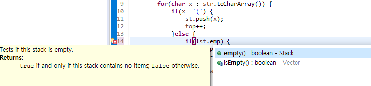

기본적인 스택 관련 알고리즘 문제를 풀던 도중, 스택이 비어있는 지 확인하기 위해 다음과 같이 코드를 작성하다 의문이 생겼다.

empty() 와 isEmpty() 의 차이가 무엇인가에 대한 의문.

## Stack과 컬렉션 프레임워크
JDK 1.0에서는 컬렉션 프레임워크가 존재하지 않았다. `Stack`, `Vector`, `HashTable` 은 컬렉션 프레임워크 이전부터 자바에서 제공하는 기본 데이터 구조이다.

JDK 1.2에서 컬렉션 프레임워크가 추가되었으며 `List`, `Map` 과 같은 표준 인터페이스가 도입되었다.

그러나 이러한 표준 컬렉션 인터페이스에서는 메소드들이 다른 규약(convention)으로 명명 되었다. 이러한 변화는 JDK 1.2에 도입된 자바 빈 표준에 영향을 받은 것으로 보인다. 이러한 메서드 이름은 이전의 `Stack`, `Vector`, `HashTable` 의 메소드 이름과 다르다. 원래의 `Stack` 클래스에서는 `empty()`로 지정된 메소드가, 컬렉션 인터페이스에선 `isEmpty()`로 이름이 지정된 것을 예로 들 수 있다.

따라서 `Stack`, `Vector`, `HashTable` 을 컬렉션 프레임워크와 호환되게 하기 위해 상응하는 컬렉션 인터페이스를 구현하게 되었고 동시에 역호환성을 위해 오래된 방법들(ex. `empty()`)이 유지되었다.