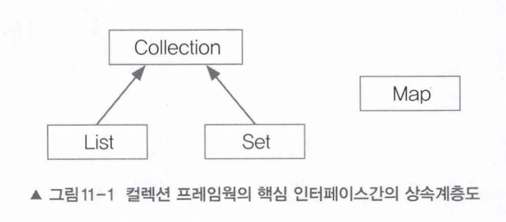
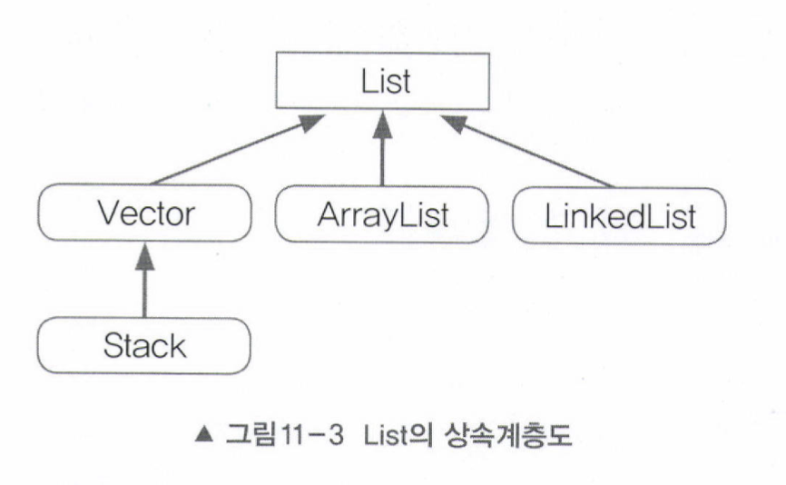
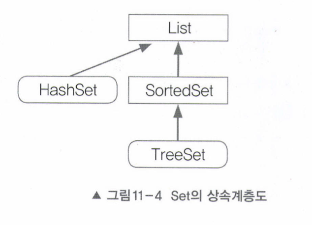
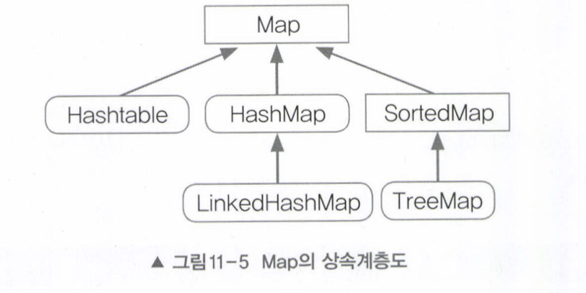

# 컬렉션 프레임웍(Collections Framework)
컬렉션 프레임웍이란, '데이터 군을 저장하는 클래스들을 표준화한 설계'를 뜻한다. 컬렉션(Collection)은 다수 데이터, 즉 데이터 그룹을, 프레임웍은 표준화된 프로그래밍 방식을 의미한다.

JDK1.2 이전까지는 Vector, Hashtable, Properties와 같은 컬렉션 클래스, 다수의 데이터를 저장할 수 있는 클래스,들을 서로 다른 각자의 방식으로 처리해야 했으나 JDK1.2부터 컬렉션 프레임웍이 등장하면서 다양한 종류의 컬렉션 클래스가 추가되고 모든 컬렉션 클래스를 표준화된 방식으로 다룰 수 있도록 체계화 되었다.

### 컬렉션 프레임웍의 장점
- 다수의 데이터를 다루는 데 필요한 다양하고 풍부한 클래스를 제공하여 프로그래머의 짐을 덜어줌
- 인터페이스와 다형성을 이용한 객체지향적 설계를 통해 표준화되어 있어 사용법을 익히기에 편리
- 재사용성이 높은 코드를 작성할 수 있음

 

## 1.1 컬렉션 프레임웍의 핵심 인터페이스
컬렉션 프레임웍에서는 컬렉션데이터 그룹을 크게 3가지 타입이 존재한다고 인식하고 각 컬렉션을 다루는데 필요한 기능을 가진 3개의 인터페이스(`List`, `Set`, `Map`)를 정의하였다. `List`와 `Set`의 공통된 부분을 다시 뽑아 새로운 인터페이스인 `Collection`을 추가로 정의하였다.

_cf) JDK1.5부터 `Iterable` 인터페이스가 추가되고 이를 `Collection` 인터페이스가 상속받도록 변경되었으나 이것은 단지 인터페이스들의 공통적인 메서드인 `iterator()` 를 뽑아서 중복을 제거하기 위한 것에 불과하므로 상속계층도에서 별 의미가 없다._

|인터페이스|특징|구현클래스|
|---|---|---|
|List|**순서가 있는** 데이터의 집합. 데이터의 **중복을 허용**. 예) 대기자 명단|ArrayList, LinkedList, Stack, Vector 등
|Set|**순서를 유지하지 않는** 데이터의 집합. 데이터의 **중복을 허용하지 않음**. 예) 양의 정수집합, 소수의 집합|HashSet, TreeSet 등
|Map|키(key)와 값(value)의 쌍(pair)으로 이루어진 데이터의 집합.  순서는 유지되지 않으며, 키는 중복을 허용하지 않고, 값은 중복을 허용한다. 예) 우편번호, 지역번호(전화번호)|HashMap, TreeMap, Hashtable, Properties 등

`Vector`, `Stack`, `Hashtable`, `Properties` 와 같은 클래스들은 컬렉션 프레임웍이 만들어지기 이전부터 존재하던 것이기 때문에 컬렉션 프레임웍의 명명법을 따르지 않는다. `Vector` 나 `Hashtable` 과 같은 기존의 컬렉션 클래스들은 호환을 위해 설계를 변경해서 남겨두었지만 가능하면 사용하지 않는 것이 좋다. 그 대신 새로 추가된 `ArrayList` 와 `HashMap을` 사용하자.

 

### List 인터페이스
List인터페이스는 중복을 허용하면서 저장순서가 유지되는 컬렉션을 구현하는데 사용된다.

### Set 인터페이스
Set인터페이스는 중복을 허용하지 않고 저장순서가 유지되지 않는 컬렉션 클래스를 구현하는데 사용된다.

### Map 인터페이스
Map인터페이스는 키(key)와 값(value)을 하나의 쌍으로 묶어서 저장하는 컬렉션 클래스를 구현하는 데 사용된다. 키는 중복될 수 없지만 값은 중복을 허용한다. 기존에 저장된 데이터와 중복된 키와 값을 저장하면 기존의 값은 없어지고 마지막에 저장된 값이 남게된다.

### Map.Entry 인터페이스
Map.Entry인터페이스는 Map인터페이스의 내부 인터페이스이다. 내부 클래스와 같이 인터페이스도 인터페이스 안에 인터페이스를 정의하는 내부 인터페이스(innter interface)를 정의하는 것이 가능하다.

Map에 저장되는 key-value쌍을 다루기 위해 내부적으로 Entry인터페이스를 정의해놓았다. 이것은 보다 객체지향적으로 설계하도록 유도하기 위한 것으로 Map인터페이스를 구현하는 클래스에서는 Map.Entry인터페이스도 함께 구현해야한다.