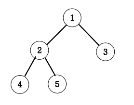

# Tree 말단 노드까지의 가장 짧은 경로
### 설명
아래 그림과 같은 이진트리에서 루트 노드 1에서 말단노드까지의 길이 중 가장 짧은 길이를 구하는 프로그램을 작성하세요.<br>
각 경로의 길이는 루트노드에서 말단노드까지 가는데 이동하는 횟수를 즉 간선(에지)의 개수를 길이로 하겠습니다.

<br>



가장 짧은 길이는 3번 노드까지의 길이인 1이다.

<br>


## DFS
```java
import java.util.*;
class Node{ 
    int data; 
    Node lt, rt; 
    public Node(int val) { 
        data=val; 
        lt=rt=null; 
    } 
} 
  
public class Main{ 
    Node root; 
    public int DFS(int L, Node root){ 
        if(root.lt==null && root.rt==null) return L;
		else return Math.min(DFS(L+1, root.lt), DFS(L+1, root.rt));
    } 
  
    public static void main(String args[]) { 
        Main tree=new Main(); 
        tree.root=new Node(1); 
        tree.root.lt=new Node(2); 
        tree.root.rt=new Node(3); 
        tree.root.lt.lt=new Node(4); 
        tree.root.lt.rt=new Node(5); 
        System.out.println(tree.DFS(0, tree.root)); 
    } 
} 

```

### 메모
최단 경로는 bfs 를 사용하는 것이 보편적이나, lt와 rt가 모두 있는 그래프(포화이진트리) 의 경우 dfs 또한 사용 가능하다.


<br>

## BFS
```java
import java.util.*;
class Node{ 
    int data; 
    Node lt, rt; 
    public Node(int val) { 
        data=val; 
        lt=rt=null; 
    } 
} 
  
public class Main{ 
    Node root; 
	public int BFS(Node root){ 
		Queue<Node> Q=new LinkedList<>();
		Q.offer(root);
		int L=0;
		while(!Q.isEmpty()){
			int len=Q.size();
			for(int i=0; i<len; i++){
				Node cur=Q.poll();
				if(cur.lt==null && cur.rt==null) return L;
				if(cur.lt!=null) Q.offer(cur.lt);
				if(cur.rt!=null) Q.offer(cur.rt);
			}
			L++;
		}
		return 0;
    } 
  
    public static void main(String args[]) { 
        Main tree=new Main(); 
        tree.root=new Node(1); 
        tree.root.lt=new Node(2); 
        tree.root.rt=new Node(3); 
        tree.root.lt.lt=new Node(4); 
        tree.root.lt.rt=new Node(5); 
        System.out.println(tree.BFS(tree.root)); 
    } 
} 
```

<br>

