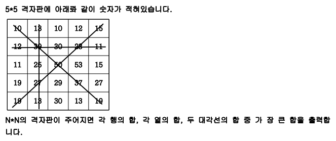

# 격자판 최대합
### 설명



<br>

### 입력
첫 줄에 자연수 N이 주어진다.(2<=N<=50) 
두 번째 줄부터 N줄에 걸쳐 각 줄에 N개의 자연수가 주어진다. 각 자연수는 100을 넘지 않는다.

<br>

### 출력
최대합을 출력합니다.


#### 예시 입력
```
5
10 13 10 12 15
12 39 30 23 11
11 25 50 53 15
19 27 29 37 27
19 13 30 13 19
```


#### 예시 출력
```
155
```

<br>


## 풀이
```java
import java.util.*;

public class Main {
	public int solution(int n, int[][] arr) {
		int answer = Integer.MIN_VALUE;
		int sum1,sum2;
		for(int i=0;i<n;i++) {
			sum1=sum2=0;
			for(int j=0;j<arr.length;j++) {
				sum1+=arr[i][j];
				sum2+=arr[j][i];
			}
			answer=Math.max(answer, sum1);
			answer=Math.max(answer, sum2);
		}
		sum1=sum2=0;
		for(int i=0;i<n;i++) {
			sum1+=arr[i][i];
			sum2+=arr[i][n-i-1];
		}
		answer=Math.max(answer, sum1);
		answer=Math.max(answer, sum2);
		int[] a=new int[3];

		return answer;
	}
	public static void main(String[] args) {
		Main T = new Main();
		Scanner kb = new Scanner(System.in);
		int n=kb.nextInt();
		int[][] arr = new int[n][n];
		for(int i=0;i<n;i++)
			for(int j=0;j<n;j++)
				arr[i][j]=kb.nextInt();
		System.out.print(T.solution(n,arr));
	}

}
```

### 메모
NXN 정방형 배열에서 대각선 값이 [i][i] 와 [i][n-i-1] 임을 기억하자<br>
아래는 궁금해서 출력해본 결과값이다
```java
int[][] arr = new int[n][n];
System.out.print(arr.length); // n이 출력된다
```

<br>

