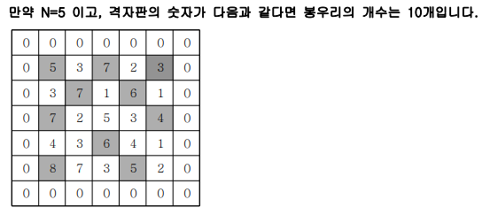

# 봉우리
### 설명
지도 정보가 N*N 격자판에 주어집니다. 각 격자에는 그 지역의 높이가 쓰여있습니다. 각 격자판의 숫자 중 자신의 상하좌우 숫자보다 큰 숫자는 봉우리 지역입니다. 봉우리 지역이 몇 개 있는 지 알아내는 프로그램을 작성하세요. 
격자의 가장자리는 0으로 초기화 되었다고 가정한다.



<br>

### 입력
첫 줄에 자연수 N이 주어진다.(2<=N<=50) 
두 번째 줄부터 N줄에 걸쳐 각 줄에 N개의 자연수가 주어진다. 각 자연수는 100을 넘지 않는다. 

<br>

### 출력
봉우리의 개수를 출력하세요.


#### 예시 입력
```
5
5 3 7 2 3
3 7 1 6 1
7 2 5 3 4
4 3 6 4 1
8 7 3 5 2
```


#### 예시 출력
```
10
```

<br>


## 풀이
```java
import java.util.*;

public class Main {
	int[] dx={-1, 0, 1, 0};
	int[] dy={0, 1, 0, -1};
	public int solution(int n, int[][] arr) {
		int answer = 0;
		for(int i=0;i<n;i++) {
			for(int j=0;j<n;j++) {
				boolean flag=true;
				for(int k=0;k<4;k++) {
					int nx=i+dx[k];
					int ny=j+dy[k];
					if(nx>=0&&nx<n&&ny>=0&&ny<n&&arr[nx][ny]>=arr[i][j]) {
						flag=false;
						break;
					}
				}
				if(flag) answer++;
			}
		}
		return answer;
	}
	public static void main(String[] args) {
		Main T = new Main();
		Scanner kb = new Scanner(System.in);
		int n=kb.nextInt();
		int[][] arr = new int[n][n];
		for(int i=0;i<n;i++)
			for(int j=0;j<n;j++)
				arr[i][j]=kb.nextInt();
		System.out.print(T.solution(n,arr));
	}

}

```

### 메모
좌표 배열을 이용하여 탐색하는 연습을 한다.
```java
int[] dx={-1, 0, 1, 0};
int[] dy={0, 1, 0, -1};
```
`ArrayIndexOutOfBoundsException` 에 유의하여 if문을 작성한다 :
```
if(nx>=0&&nx<n&&ny>=0&&ny<n)
```

<br>

